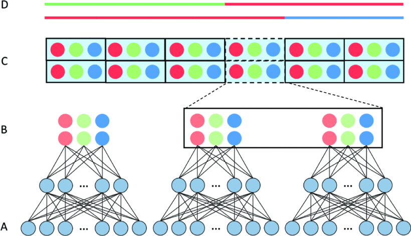

# LAI-Net: Local-Ancestry Inference with Neural Networks

Official implementation of LAI-Net





## Notice

The code is "as is" and will not be actively supported or updated. 
Instead, we recommend you use Gnomix for improved accuracy and speed: https://github.com/AI-sandbox/gnomix


## Dependencies
The dependencies are listed in *requirements.txt*. They can be installed via pip:
```
pip install -r requirements.txt
```


## How to run LAI-Net

LAI-Net can be used in two ways:

- Training a model from scratch using provided training data or 
- Loading pre-trained network models


For training and inference use:

```
python3 LAINET.py -i 20 -q test.vcf -r founders.vcf -m founders.map -o output/test- -d "cuda"
```


For inference-only from pre-trained model use:

```
python3 LAINET.py -q test.vcf -n output/pre-trained- -o output/test-
```

Input flags include:

- '-q', '--query', Absolute path of query samples .VCF file (Required always)
- '-r', '--reference',Absolute path of reference panel .VCF file (Required for training)
- '-m', '--map', Absolute path of labels list .map file (Required for training)
- '-g', '--gmap', Genetic map .gmap file - only used when saving results (Optional)
- '-o', '--output', Output folder and prefix (Required always)
- '-n', '--network-folder', Folder and prefix of trained network (Required for inference only)
- '-c', '--config', Config .yaml file (Optional, default='configs/default.yaml')
- '-d', '--device',Device to train and inference network (Optional)
- '-i', '--chm', Chromosome Number (Required for training)


## Examples

For using Small LAI-Net use:

```
python3 LAINET.py -i 20 -q test.vcf -r founders.vcf -m founders.map -o output/test- -d "cuda" -c configs/small.yaml
```

For using cpu use:

```
python3 LAINET.py -i 20 -q test.vcf -r founders.vcf -m founders.map -o output/test- -d "cpu"
```


For UK Biobank or other genotyping array dataset:

```
python3 LAINET.py -i 20 -q test.vcf -r founders.vcf -m founders.map -o output/test- -c configs/default-ukb.yaml
```


## License

**NOTICE**: This software is available free of charge for academic research use only. Commercial users, for profit companies or consultants, and non-profit institutions not qualifying as "academic research" must contact the [Stanford Office of Technology Licensing](https://otl.stanford.edu/) for a separate license. This applies to this repository directly and any other repository that includes source, executables, or git commands that pull/clone this repository as part of its function. Such repositories, whether ours or others, must include this notice. Academic users may fork this repository and modify and improve to suit their research needs, but also inherit these terms and must include a licensing notice to that effect.

## Cite

#### When using this software, cite: 
Montserrat, Daniel Mas, Carlos Bustamante, and Alexander Ioannidis. "LAI-Net: Local-ancestry inference with neural networks." ICASSP 2020-2020 IEEE International Conference on Acoustics, Speech and Signal Processing (ICASSP). IEEE, 2020.

https://ieeexplore.ieee.org/document/9053662

```
@inproceedings{montserrat2020lai,
  title={LAI-Net: Local-ancestry inference with neural networks},
  author={Montserrat, Daniel Mas and Bustamante, Carlos and Ioannidis, Alexander},
  booktitle={ICASSP 2020-2020 IEEE International Conference on Acoustics, Speech and Signal Processing (ICASSP)},
  pages={1314--1318},
  year={2020},
  organization={IEEE}
}
```
